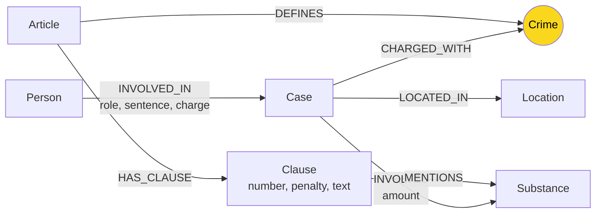

# Thiết kế Ontology — Day 19

**Họ tên:** Vũ Văn Hà  **MSSV:** 2A202602589

**Lựa chọn**:
- [x] Dùng ontology gợi ý (có chỉnh nhỏ ở bước truy hồi context)
- [ ] Tự thiết kế (xét bonus +15, xem `SUBMISSION.md`)

## 1. Sơ đồ

Node cầu nối giữa KB luật và KB tin tức là **Crime**.

## 2. Entity types (node labels)

| Label | Ý nghĩa | Khóa định danh (`MERGE` theo) | Properties | Lấy từ KB nào | Trích bằng |
| --- | --- | --- | --- | --- | --- |
| `Article` | Điều luật trong BLHS hoặc luật liên quan | `id` | `id`, `title`, `law`, `doc_id` | Luật | Regex từ metadata và nội dung markdown |
| `Clause` | Khoản trong một điều luật | `id` | `id`, `number`, `penalty`, `text`, `doc_id` | Luật | Regex tách các dòng `1.`, `2.`... |
| `Crime` | Tội danh chuẩn, dùng làm cầu nối | `name` | `name` | Cả luật và tin | Luật: regex/metadata; tin: LLM rồi chuẩn hóa bằng `link_entity` |
| `Case` | Một vụ việc/vụ án trong bài báo | `name` | `name`, `summary`, `date`, `doc_id`, `source_title` | Tin tức | LLM JSON |
| `Person` | Người liên quan trong vụ việc | `name` | `name`, `aliases` | Tin tức | LLM JSON |
| `Substance` | Chất ma túy/tiền chất được nhắc tới | `name` | `name` | Cả luật và tin | Luật: danh sách chuẩn + tìm chuỗi; tin: LLM JSON |
| `Location` | Địa điểm vụ việc | `name` | `name` | Tin tức | LLM JSON |

## 3. Relationships

| Type | Từ → Đến | Properties trên cạnh | Ý nghĩa |
| --- | --- | --- | --- |
| `DEFINES` | `Article` → `Crime` | Không | Điều luật định nghĩa tội danh nào |
| `HAS_CLAUSE` | `Article` → `Clause` | Không | Điều luật gồm các khoản nào |
| `MENTIONS` | `Clause` → `Substance` | Không | Khoản luật nhắc tới chất ma túy nào |
| `CHARGED_WITH` | `Case` → `Crime` | Không | Vụ việc bị xử lý/truy tố theo tội danh nào |
| `INVOLVES` | `Case` → `Substance` | `amount` | Vụ việc liên quan chất gì và khối lượng bao nhiêu nếu có |
| `LOCATED_IN` | `Case` → `Location` | Không | Vụ việc xảy ra hoặc được xét xử ở đâu |
| `INVOLVED_IN` | `Person` → `Case` | `role`, `sentence`, `charge` | Người tham gia vụ việc với vai trò, tội danh và mức án nào |

## 4. Node cầu nối giữa 2 KB

- **Node nào:** `Crime`.
- **Vì sao chọn node này:** KB luật định nghĩa các tội danh qua `Article -[:DEFINES]-> Crime`, còn KB tin tức mô tả mỗi vụ án bị xử lý về tội gì qua `Case -[:CHARGED_WITH]-> Crime`. Vì vậy `Crime` là điểm chung tự nhiên để đi từ vụ án sang điều luật.
- **Cách đảm bảo hai phía khớp tên:** tên tội trong luật được chuẩn hóa bằng `normalize_crime`. Khi LLM trích xuất tội danh từ tin, hàm `link_entity` chuẩn hóa cả hai phía, khớp chính xác trước, sau đó fuzzy match bằng `difflib.get_close_matches(cutoff=0.8)` và chỉ trả về tên chuẩn đã có trong danh sách luật.
- **Khi nào cầu gãy, và xử lý thế nào:** cầu gãy khi bài báo không nêu tội danh rõ ràng, LLM trả JSON sai dạng, hoặc tên tội quá khác tên chuẩn. Cách xử lý là đưa danh sách tội danh chuẩn vào prompt trích xuất, dùng `link_entity` sau LLM, và soi các `Case` không có cạnh `CHARGED_WITH` bằng Cypher.

## 5. Competency questions

| Câu | Đường đi (Cypher pattern) | Trả lời được? |
| --- | --- | --- |
| Q1 | `(:Article {law:'Luật Phòng, chống ma túy 2021'})-[:HAS_CLAUSE]->(:Clause)` kết hợp vector chunk luật để lấy định nghĩa tiền chất | Có |
| Q2 | `(:Person)-[:INVOLVED_IN {sentence}]->(:Case)` với `Case.summary/source_title` từ bài báo đường dây 36kg | Có |
| Q3 | `(:Person {name:'Lê Minh Thành'})-[:INVOLVED_IN {sentence, charge}]->(:Case)-[:CHARGED_WITH]->(:Crime)<-[:DEFINES]-(:Article)-[:HAS_CLAUSE]->(:Clause {number:1})` | Có |
| Q4 | `(:Person {aliases/name:'Hoàng Nato'})-[:INVOLVED_IN]->(:Case)-[:CHARGED_WITH]->(:Crime)<-[:DEFINES]-(:Article)-[:HAS_CLAUSE]->(:Clause)`; khi câu hỏi hỏi tối đa thì lấy các khoản cao nhất | Có |
| Q5 | `(:Person {name:'Cái Quang Huy'})-[:INVOLVED_IN]->(:Case)-[:INVOLVES]->(:Substance {name:'MDMA'})<-[:MENTIONS]-(:Clause)<-[:HAS_CLAUSE]-(:Article)-[:DEFINES]->(:Crime)<-[:CHARGED_WITH]-(:Case)` | Có |
| Q6 | `(:Case)-[:INVOLVES]->(:Substance {name:'MDMA'})` rồi mở rộng sang `Person`, `summary`, `doc_id` của từng vụ | Có |

## 6. Quyết định thiết kế và đánh đổi

1. Chọn `Crime` làm node cầu nối thay vì nối trực tiếp `Case` với `Article`. Cách này linh hoạt hơn khi nhiều điều luật/tội danh xuất hiện, nhưng phụ thuộc vào chuẩn hóa tên tội.
2. Chọn `Clause` là node riêng thay vì property của `Article`. Nhờ vậy truy hồi được từng khoản và nối `Clause` với `Substance`, đổi lại graph có nhiều node hơn và prompt context dài hơn.
3. Chọn `sentence`, `role`, `charge` làm property của cạnh `INVOLVED_IN` thay vì node riêng. Mức án gắn với vai trò của một người trong một vụ cụ thể, nên để trên cạnh giúp truy vấn đơn giản; hạn chế là khó biểu diễn nhiều giai đoạn tố tụng cho cùng một người.
4. Chọn `Substance` làm node dùng chung giữa luật và tin. Điều này hỗ trợ câu hỏi về MDMA/Ketamine và lọc khoản luật theo chất, nhưng hiện chưa xử lý đầy đủ đồng nghĩa như “kẹo” với MDMA nếu LLM không chuẩn hóa đúng.

## 7. So với ontology gợi ý (bắt buộc nếu xét bonus)

Không xét bonus. Ontology trong code dùng ontology gợi ý của lab. Phần khác biệt chỉ nằm ở chiến lược truy hồi trong `Neo4jGraph.context`: nếu câu hỏi hỏi “tối đa/cao nhất” thì lấy thêm các khoản cao hơn; nếu câu hỏi nhắc chất như MDMA thì mở rộng sang các vụ `Case -[:INVOLVES]-> Substance`.

| Điểm khác | Gợi ý làm gì | Bạn làm gì | Vấn đề nó giải quyết | Bằng chứng |
| --- | --- | --- | --- | --- |
| Không áp dụng bonus | Dùng ontology gợi ý | Giữ nguyên label/relationship gợi ý | Đủ yêu cầu chuẩn của lab | `pytest tests/test_base.py -q` → `41 passed`; `pytest tests/test_graph.py -q` → `7 passed`; `python bench_kg.py --check` → đủ 7 dòng `[OK]` |

### Đối chiếu bản thiết kế với graph thật

Số liệu lấy từ Neo4j sau `python bench_kg.py --judge` (201 node / 378 cạnh), dùng truy vấn `MATCH (n) RETURN labels(n)[0] AS label, count(*) AS n ORDER BY n DESC`:

| Label | Số node | | Quan hệ | Số cạnh |
| --- | --- | --- | --- | --- |
| `Clause` | 99 | | `MENTIONS` | 169 |
| `Person` | 42 | | `HAS_CLAUSE` | 99 |
| `Article` | 18 | | `INVOLVED_IN` | 51 |
| `Crime` | 13 | | `INVOLVES` | 19 |
| `Case` | 13 | | `CHARGED_WITH` | 15 |
| `Substance` | 11 | | `DEFINES` | 13 |
| `Location` | 5 | | `LOCATED_IN` | 12 |

Cả 7 label và 7 quan hệ trong bản thiết kế đều có mặt trong graph; không label nào bằng 0. `Article` = 18 và `Crime` = 13 cố định vì lấy từ luật bằng regex.

## 8. Hạn chế còn lại

- `Person` và `Case` dùng tên do LLM sinh ra làm khóa nên có thể trùng hoặc tách node nếu hai bài báo gọi khác nhau.
- `Substance` chưa có bảng đồng nghĩa đầy đủ, ví dụ “kẹo” cần được LLM map về MDMA.
- Chưa mô hình hóa chính xác ngưỡng khối lượng theo từng điểm trong khoản luật; `context()` hiện lấy khoản có nhắc chất, nên có thể đưa dư khoản.
- Chưa tách các giai đoạn tố tụng như bắt, khởi tố, xét xử sơ thẩm, phúc thẩm.
